# Portfolio & Risk Analytics

**Le profil Quality du Projet 1 rapporte-t-il quelque chose hors échantillon, et avec quel degré de certitude ? Projet 3/3 d'un portfolio finance quantitative — Python / pandas / SciPy.**

```
01 — Signal daté      le droit d'utiliser une donnée commence à son dépôt, pas à la clôture
02 — Covariance       empirique, Ledoit-Wolf, Marchenko-Pastur, jugés hors échantillon
03 — Backtest         walk-forward, coûts, Sharpe déflaté, bootstrap par blocs
04 — Risque           GARCH, VaR filtrée, tests de Kupiec et de Christoffersen
```

Le fil rouge : **chaque méthode est d'abord validée sur un monde simulé où la vérité est connue**, puis appliquée telle quelle aux données réelles. Le [Projet 2](https://github.com/samuelhcesari/quant-finance-02-derivatives) confrontait l'analytique au numérique ; celui-ci confronte ce qu'un backtest affirme à ce qu'il a le droit d'affirmer.


> **État des résultats.** Tous les chiffres et figures de ce README viennent du **monde simulé** (`make simulated`, aucune donnée externe). Le pipeline sur données réelles (`make fetch && make real`) est écrit mais n'a pas encore été exécuté : voir [Données réelles](#données-réelles).

Détail étape par étape : [`PORTFOLIO_PROGRESS.md`](PORTFOLIO_PROGRESS.md) · formules, hypothèses et choix : [`docs/methodology.md`](docs/methodology.md) · tous les chiffres : [`results/benchmark_simulated.json`](results/benchmark_simulated.json).

## Motivation

Le [Projet 1](https://github.com/samuelhcesari/quant-finance-01-pipeline) classe 43 entreprises selon des profils d'investissement, mais ne teste jamais si ces classements rapportent. Le Projet 2 valorise des options dans un monde entièrement synthétique. Il manquait le projet qui prend des décisions datées, mesure leur résultat, et dit honnêtement ce que l'échantillon permet de conclure.

## Research Question

*Un portefeuille des entreprises qui passent le profil Quality (ROIC ≥ 15 %, marge EBITDA moyenne sur 3 ans ≥ 20 %, dette nette / EBITDA ≤ 2, croissance sur 3 ans ≥ 0) fait-il mieux que l'univers équipondéré dont il est tiré ? Et si oui, cet écart se distingue-t-il de ce que le hasard produit ?*

Les hypothèses, le portefeuille principal (équipondéré), le coût (10 pb) et les trois variantes testées sont fixés dans [`configs/research.yaml`](configs/research.yaml) avant le run. Le nombre de variantes entre dans le calcul du Sharpe déflaté.

## Le monde simulé

45 titres, 3 secteurs, 2008–2025, mêmes tables que le Projet 1 (états financiers annuels avec date de dépôt, prix quotidiens). Quatre choses y sont vraies **par construction**, et chaque partie doit les retrouver :

| Vérité imposée | Partie qui doit la retrouver |
|---|---|
| Le profil Quality n'a aucun alpha | 01, 03 |
| Le cours saute le jour du dépôt du 10-K, selon la surprise de marge | 01 |
| La covariance des rendements est une matrice connue | 02 |
| Le marché suit un GARCH(1,1) à queues épaisses | 04 |

Le monde illustré dans les figures est le premier d'une famille de 200 (graines 0 à 199). Un monde isolé est un tirage : ce sont les 200 qui valident.

---

## 01 — Signal daté

Le Projet 1 rattache un ratio à la clôture de l'exercice. Un 10-K n'est déposé que 5 à 10 semaines plus tard (médiane 54 jours ici). Utiliser le ratio dès la clôture, c'est connaître le rapport annuel avant sa publication.

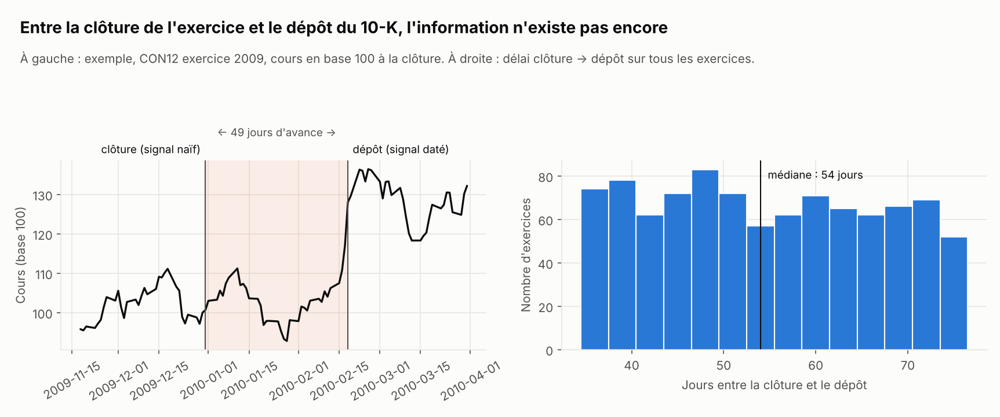

Le signal « daté » n'est disponible qu'au lendemain du dépôt (`signal.asof_panel`, jointure *as-of*). Le test central du projet vérifie que le signal à une date `d` est **identique** qu'on le calcule sur toute la base ou sur une base amputée de tout dépôt postérieur à `d` ; le même test appliqué au signal naïf échoue, ce qui prouve qu'il détecte bien la fuite.

**Ce que la fuite rapporte.** Le jour du dépôt, les entreprises qui entrent dans le profil gagnent +2,9 % en moyenne et celles qui en sortent perdent −2,2 %. Le signal naïf est déjà positionné.

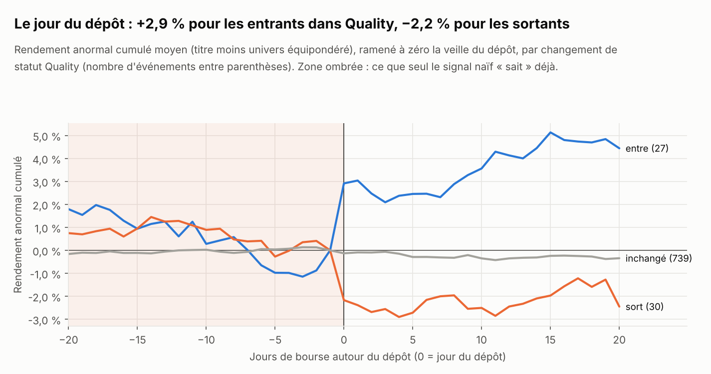

**Vérité connue.** Sur 200 mondes où l'alpha de Quality est nul :

| | Alpha mesuré moyen | Rejet de « alpha = 0 » à 5 % |
|---|---|---|
| Signal daté | −0,05 %/an (± 0,13) | 4,0 % des mondes (attendu : 5 %) |
| Signal naïf | **+0,52 %/an** | 5,5 % |

Le signal daté retrouve zéro et son test est calibré. Le signal naïf fabrique un demi-point d'alpha par an, dans 86 % des mondes. Le biais est trop petit pour se voir dans un seul backtest : c'est ce qui le rend dangereux.


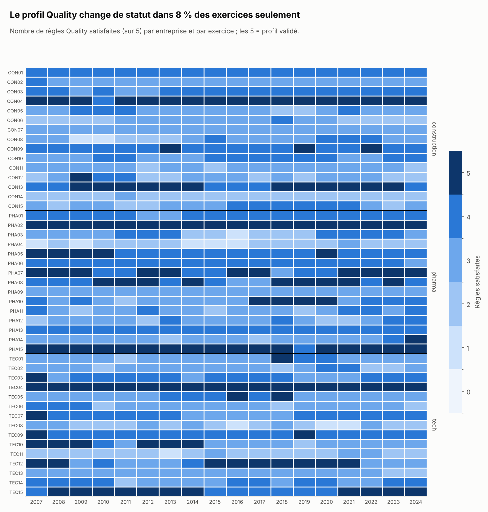

---

## 02 — Covariance

Avec N titres et T observations, la covariance empirique devient inutilisable quand q = N/T n'est plus petit. Trois estimateurs : empirique, Ledoit-Wolf (rétrécissement linéaire), et nettoyage des valeurs propres sous le bord de Marchenko-Pastur (implémenté dans le dépôt, [`covariance.py`](src/quant_portfolio/covariance.py)).

**Spectre.** Sur une fenêtre de 252 jours, 42 des 45 valeurs propres de la matrice de corrélation sont indiscernables de celles d'une matrice de pur bruit. Les 3 qui dépassent sont le marché et les secteurs.

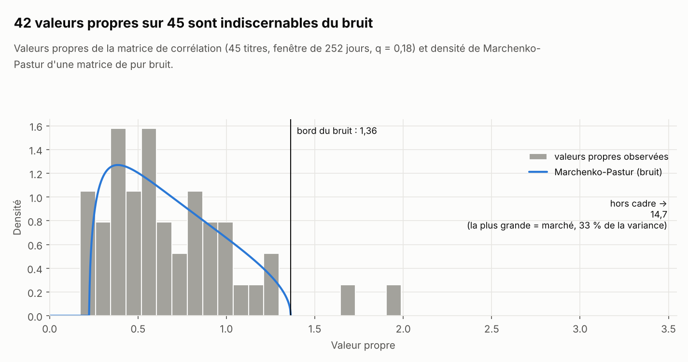

**Vérité connue.** On tire des observations d'une covariance connue et on mesure la volatilité *vraie* du portefeuille à variance minimale, rapportée à celle de l'oracle :

| q = N/T | 0,10 | 0,25 | 0,50 | 0,75 | 0,90 |
|---|---|---|---|---|---|
| Empirique | 1,06 | 1,14 | 1,44 | 1,95 | 3,09 |
| Ledoit-Wolf | 1,05 | 1,10 | 1,17 | 1,20 | 1,20 |
| Marchenko-Pastur | 1,04 | 1,07 | 1,13 | 1,16 | 1,17 |


**Hors échantillon.** Portefeuille à variance minimale rebalancé chaque mois : avec 63 jours d'estimation, la covariance empirique donne 25,3 % de volatilité réalisée et retourne le portefeuille 4,8 fois par mois ; Marchenko-Pastur donne 15,3 % pour 1,05.

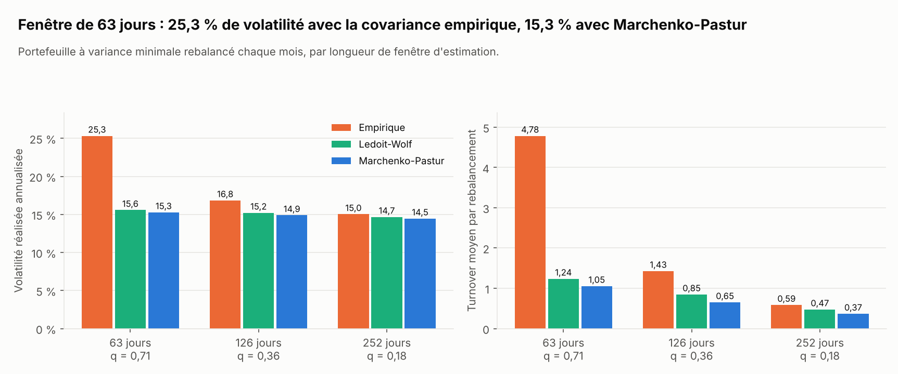

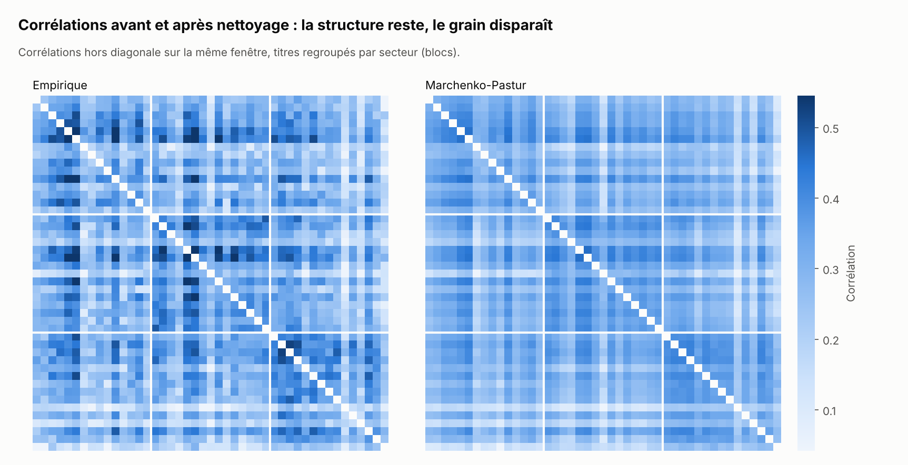

---

## 03 — Backtest

Rebalancement mensuel, poids décidés à la clôture et appliqués à partir du lendemain, 10 pb par unité de turnover. Le rendement jugé est le rendement **actif** : Quality moins l'univers équipondéré.

| Portefeuille | Rendement | Volatilité | Sharpe | Drawdown max | Rendement actif | Turnover / an |
|---|---|---|---|---|---|---|
| Quality équipondéré (principal) | 7,0 % | 18,7 % | 0,35 | −37,2 % | −1,4 % | 1,21 |
| Quality inverse volatilité | 7,1 % | 18,5 % | 0,36 | −36,5 % | −1,3 % | 1,18 |
| Quality variance minimale | 7,3 % | 18,4 % | 0,36 | −33,4 % | −1,2 % | 1,76 |
| Univers équipondéré | 9,1 % | 15,5 % | 0,51 | −35,1 % | — | 0,75 |

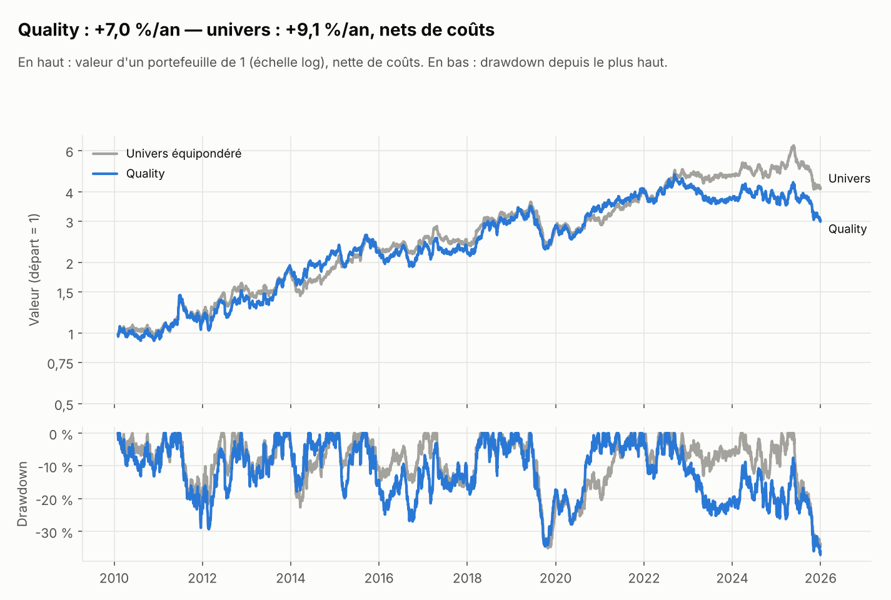

**Se distingue-t-il du hasard ?** Alpha estimé −1,4 %/an, intervalle à 95 % [−5,9 ; +3,0] par bootstrap stationnaire. La vérité (zéro) est dans l'intervalle. Sharpe déflaté : 26 %.

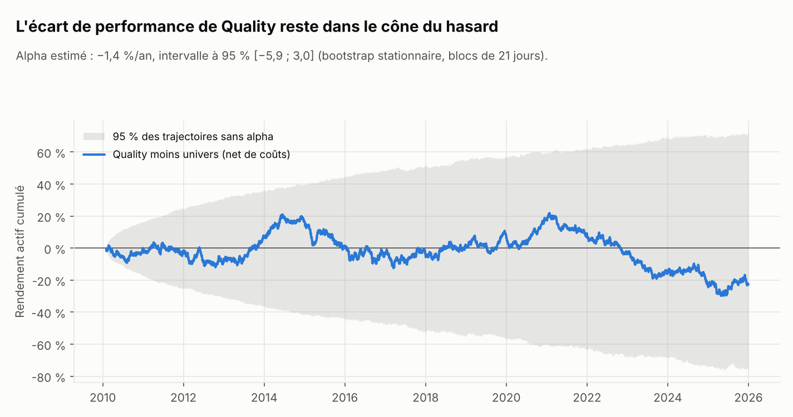

**Ce que l'échantillon permet de voir.** Avec 16 ans et 9,2 % de tracking error, le plus petit alpha détectable 4 fois sur 5 est **5,6 %/an**. Un vrai alpha de 2 % passerait inaperçu : « non significatif » ne veut pas dire « nul ».

**Laboratoire du hasard.** 1 000 portefeuilles tirés au sort, de même taille que Quality, sans aucune information : 34 passent le seuil de 95 % du Probabilistic Sharpe Ratio. Le meilleur affiche un PSR de 99,8 % ; une fois corrigé du nombre d'essais, son Sharpe déflaté tombe à 38 %.

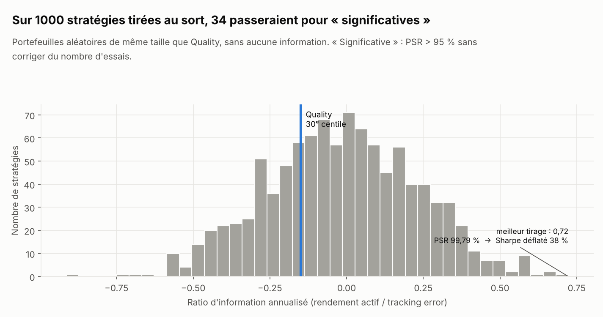

**Expositions.** Le rendement actif est régressé sur les facteurs (erreurs Newey-West). Dans le monde simulé : marché et facteurs sectoriels ; sur données réelles : Fama-French 5 facteurs et momentum.

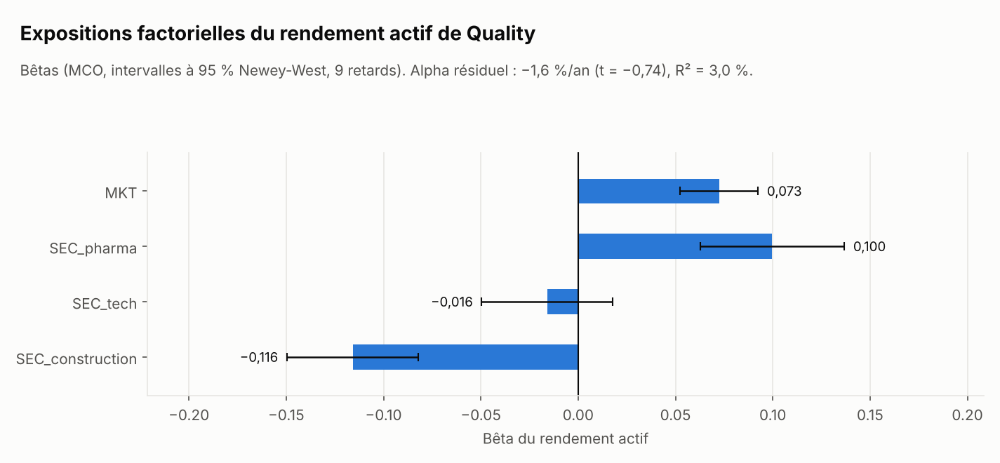

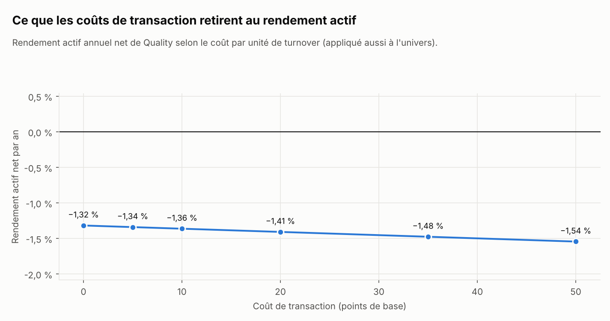

---

## 04 — Risque

**GARCH retrouve des paramètres connus.** Sur 20 séries simulées (α = 0,08, β = 0,90) : α estimé 0,079 ± 0,010, β estimé 0,895 ± 0,015 (quasi-maximum de vraisemblance, [`risk.py`](src/quant_portfolio/risk.py)).

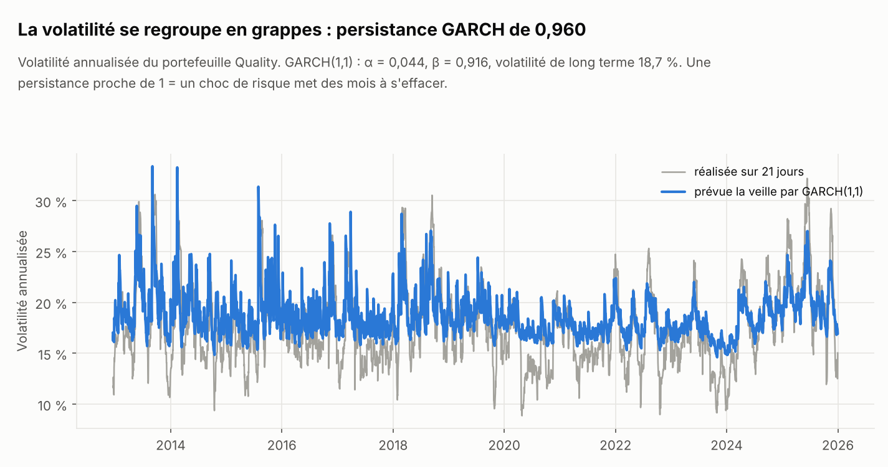

**Trois VaR à un jour, jugées hors échantillon** sur 3 403 jours du portefeuille Quality. Chaque prévision n'utilise que le passé (vérifié par un test qui réécrit le futur).

| VaR | Seuil | Dépassements (attendus) | Kupiec p | Indépendance p |
|---|---|---|---|---|
| Normale | 95 % | 166 (170) | 0,74 | **0,02** |
| Normale | 99 % | 50 (34) | **0,01** | 0,77 |
| Historique 500 j | 95 % | 180 (170) | 0,44 | **0,04** |
| Historique 500 j | 99 % | 42 (34) | 0,19 | 0,31 |
| Filtrée (GARCH) | 95 % | 157 (170) | 0,29 | 0,31 |
| Filtrée (GARCH) | 99 % | 30 (34) | 0,48 | 0,47 |

Seule la simulation historique filtrée passe les deux tests aux deux seuils : les VaR normale et historique ont des dépassements groupés, parce qu'elles ignorent que la volatilité vient de monter.

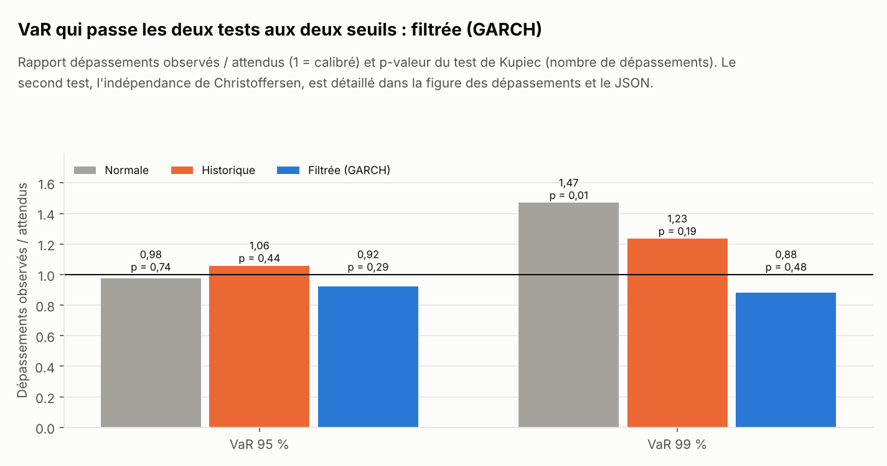

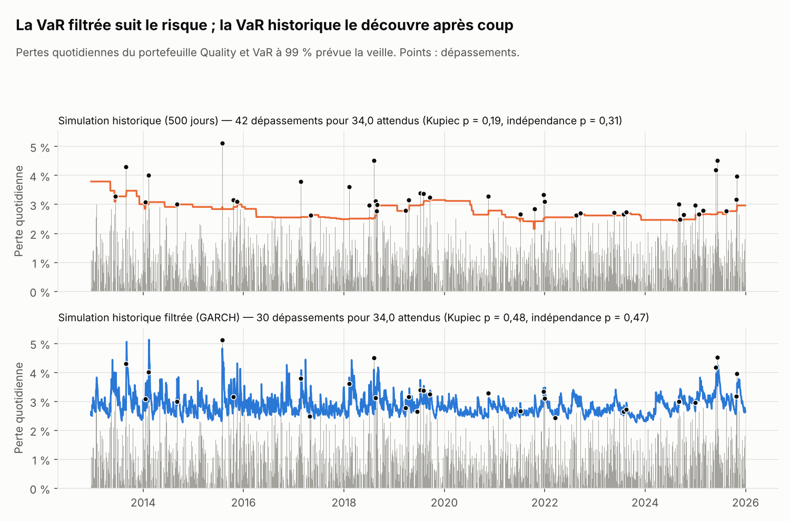

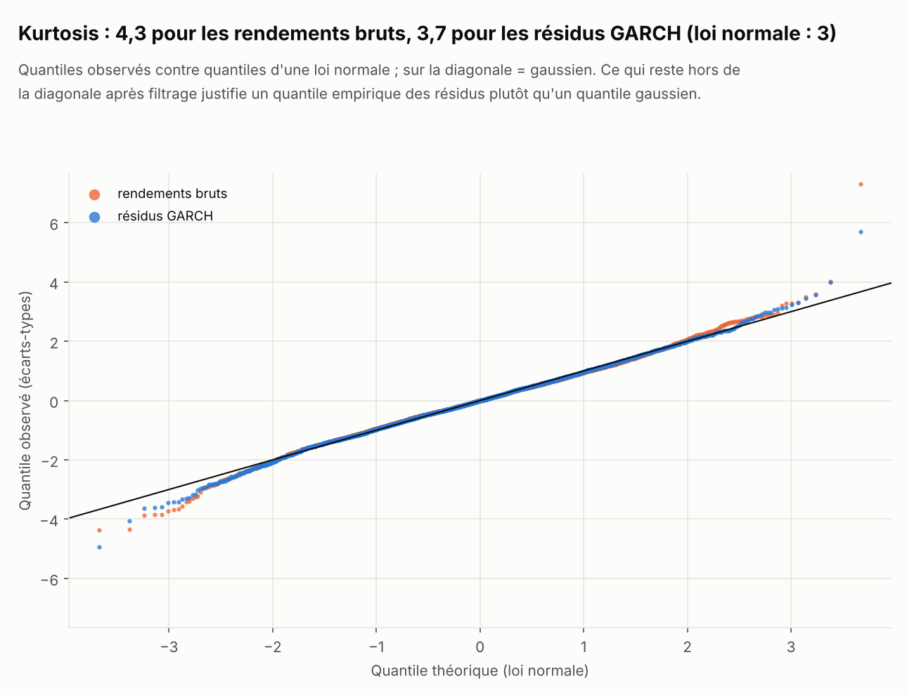

---

## Données réelles

Le même code tourne sur les données du Projet 1, sans modification :

```
# Projet 1 cloné dans le dossier voisin, pipeline déjà exécuté (data/processed/financials_annual.csv)
make fetch     # prix ajustés depuis 2005 (Yahoo) + facteurs Fama-French quotidiens
make real      # -> results/benchmark_real.json et results/figures/real/
```

`make fetch` existe parce que le Projet 1 ne conserve que 5 ans de clôtures non ajustées des dividendes, insuffisant pour un backtest.

**À savoir avant de lire les résultats réels :**

- **Biais de survivance.** Les 43 entreprises sont toutes cotées aujourd'hui. Le niveau de rendement de l'univers est surestimé ; l'écart Quality − univers l'est moins, mais pas nécessairement pas du tout.
- **Puissance.** 43 titres et une quinzaine d'années : le plus petit alpha détectable sera de plusieurs points par an. Le résultat attendu est « pas d'alpha significatif », et il sera rapporté comme tel.
- **Date de dépôt du 10-K, pas de l'annonce des résultats.** Les résultats sont publiés quelques semaines avant le 10-K. La date de dépôt est donc prudente : elle ne regarde jamais dans le futur, mais réagit un peu tard. L'étude d'événement réelle montrera sans doute peu de mouvement le jour du dépôt.
- **Covariance de référence.** Sans vérité connue, l'expérience « oracle » de la partie 02 prend l'estimation Ledoit-Wolf plein échantillon comme référence, et le dit sur la figure.

## Limitations

- Un seul signal, binaire, annuel. Pas de combinaison de signaux, pas de données trimestrielles.
- Coût de transaction forfaitaire, sans impact de marché ni contrainte de capacité.
- Variance minimale sans contrainte de signe (ventes à découvert permises) : c'est un instrument de mesure des estimateurs, pas un portefeuille investissable.
- VaR à un jour sur un portefeuille agrégé : pas de décomposition par titre, pas de stress scénarios.
- `make fetch` et `load_real` n'ont pas encore été exécutés.

**Extensions possibles**, volontairement laissées de côté pour garder un périmètre resserré : optimisation sous contraintes (long-only, turnover), Black-Litterman avec les scores comme vues, Hierarchical Risk Parity, validation croisée purgée combinatoire, test SPA de Hansen, théorie des valeurs extrêmes, distance au défaut de Merton à partir des bilans du Projet 1.

## Reproducibility

```
git clone https://github.com/samuelhcesari/quant-finance-03-portfolio-risk
cd quant-finance-03-portfolio-risk
python -m venv .venv && source .venv/bin/activate   # ou .venv\Scripts\activate sous Windows
make install
make simulated   # 4 parties, 200 mondes, 18 figures — environ 2 minutes
make test        # 27 tests
```

Graine fixée : deux exécutions donnent un `benchmark_simulated.json` identique à l'octet.

## Usage

```python
from quant_portfolio import config, signal, covariance, backtest, risk
from quant_portfolio.simulate import simulate

cfg = config.load()
world = simulate(cfg)                                              # ou world.load_real(cfg)

m = signal.quality(signal.metrics(world.fund), cfg["quality_rules"])
dates = backtest.month_ends(world.returns.index, "2010-01-01")
flag = signal.asof_panel(m, dates, "avail_pit")                    # signal daté au dépôt

r, turnover = backtest.run(backtest.equal_weight(flag == 1), world.returns, cost_bps=10)
backtest.psr(r.values)                                             # Probabilistic Sharpe Ratio

covariance.mp_clip(world.returns.iloc[-252:].values)               # covariance nettoyée
risk.garch_fit(r.values)["alpha"]                                  # GARCH(1,1)
```

## Tests

```
pytest
```

27 tests, ciblés sur ce qui peut fausser un résultat sans faire planter le code : fuite de données futures dans le signal, dans le moteur de backtest et dans la VaR ; ratios recalculés à la main ; formules (PSR, maximum attendu de N Sharpe, densité de Marchenko-Pastur, variance minimale à deux actifs) ; récupération de paramètres connus (GARCH, bêtas, prime de 6 %/an injectée dans la simulation).

## References

- Bailey, D. & López de Prado, M. (2014) — *The Deflated Sharpe Ratio*.
- Ledoit, O. & Wolf, M. (2004) — *A well-conditioned estimator for large-dimensional covariance matrices*.
- Laloux, Cizeau, Bouchaud & Potters (1999) — *Noise dressing of financial correlation matrices*.
- Politis, D. & Romano, J. (1994) — *The stationary bootstrap*.
- Newey, W. & West, K. (1987) — covariance HAC.
- Barone-Adesi, Giannopoulos & Vosper (1999) — simulation historique filtrée.
- Kupiec (1995) ; Christoffersen (1998) — tests de couverture de la VaR.
- Harvey, Liu & Zhu (2016) — *…and the Cross-Section of Expected Returns* (tests multiples).
