# Portfolio & Risk Analytics

**Le profil Quality du Projet 1 rapporte-t-il quelque chose hors échantillon, et avec quel degré de certitude ? Projet 3/3 d'un portfolio finance quantitative — Python / pandas / SciPy.**

```
01 — Signal daté      le droit d'utiliser une donnée commence à son dépôt, pas à la clôture
02 — Covariance       empirique, Ledoit-Wolf, Marchenko-Pastur, jugés hors échantillon
03 — Backtest         walk-forward, coûts, Sharpe déflaté, bootstrap par blocs
04 — Risque           GARCH, VaR filtrée, tests de Kupiec et de Christoffersen
```

Le fil rouge : **chaque méthode est d'abord validée sur un monde simulé où la vérité est connue**, puis appliquée telle quelle aux données réelles. Le [Projet 2](https://github.com/samuelhcesari/quant-finance-02-derivatives) confrontait l'analytique au numérique ; celui-ci confronte ce qu'un backtest affirme à ce qu'il a le droit d'affirmer.

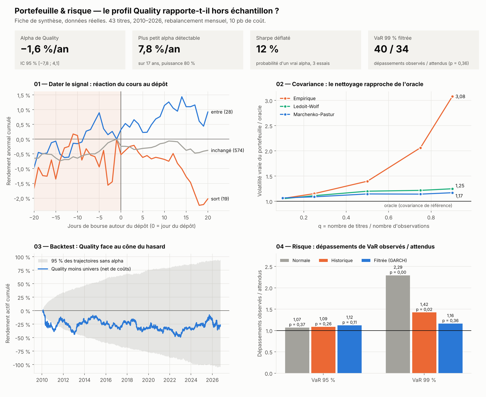

**Réponse courte.** Sur les 43 entreprises du Projet 1, de 2010 à 2026, le portefeuille Quality fait **−1,6 %/an** par rapport à l'univers, avec un intervalle à 95 % de [−7,8 ; +4,1]. Rien ne le distingue du hasard, et l'échantillon ne permettrait de toute façon de détecter qu'un alpha supérieur à 7,8 %/an. Le résultat est un constat d'ignorance mesurée, pas une stratégie.

Détail étape par étape : [`PORTFOLIO_PROGRESS.md`](PORTFOLIO_PROGRESS.md) · formules, hypothèses et choix : [`docs/methodology.md`](docs/methodology.md) · tous les chiffres : [`results/benchmark_real.json`](results/benchmark_real.json) et [`results/benchmark_simulated.json`](results/benchmark_simulated.json).

## Motivation

Le [Projet 1](https://github.com/samuelhcesari/quant-finance-01-pipeline) classe 43 entreprises selon des profils d'investissement, mais ne teste jamais si ces classements rapportent. Le Projet 2 valorise des options dans un monde entièrement synthétique. Il manquait le projet qui prend des décisions datées, mesure leur résultat, et dit honnêtement ce que l'échantillon permet de conclure.

## Research Question

*Un portefeuille des entreprises qui passent le profil Quality (ROIC ≥ 15 %, marge EBITDA moyenne sur 3 ans ≥ 20 %, dette nette / EBITDA ≤ 2, croissance sur 3 ans ≥ 0) fait-il mieux que l'univers équipondéré dont il est tiré ? Et si oui, cet écart se distingue-t-il de ce que le hasard produit ?*

Le portefeuille principal (équipondéré), le coût (10 pb) et les trois variantes testées sont fixés dans [`configs/research.yaml`](configs/research.yaml) avant le run. Le nombre de variantes entre dans le calcul du Sharpe déflaté.

## Data

| Source | Contenu | Usage |
|---|---|---|
| Projet 1 (`financials_annual.csv`, SEC EDGAR) | 714 exercices, 43 entreprises, avec date de dépôt | signal Quality |
| Yahoo Finance (`make fetch`) | clôtures ajustées quotidiennes depuis 2005 | rendements |
| Kenneth French Data Library (`make fetch`) | 5 facteurs Fama-French + momentum, quotidiens | régression factorielle |

Les ratios sont recalculés en pandas à partir du fichier du Projet 1 et **retombent sur ses chiffres publiés** : 107 exercices sur 714 passent le profil Quality, ROIC d'Apple de 42,1 % en 2020 et 87,4 % en 2025.

## Le monde simulé

45 titres, 3 secteurs, 2008–2025, mêmes tables que le Projet 1. Quatre choses y sont vraies **par construction**, et chaque partie doit les retrouver :

| Vérité imposée | Partie qui doit la retrouver |
|---|---|
| Le profil Quality n'a aucun alpha | 01, 03 |
| Le cours saute le jour du dépôt du 10-K, selon la surprise de marge | 01 |
| La covariance des rendements est une matrice connue | 02 |
| Le marché suit un GARCH(1,1) à queues épaisses | 04 |

Le monde illustré dans les figures est le premier d'une famille de 200 (graines 0 à 199). Un monde isolé est un tirage : ce sont les 200 qui valident.

<details>
<summary>Fiche de synthèse du monde simulé</summary>

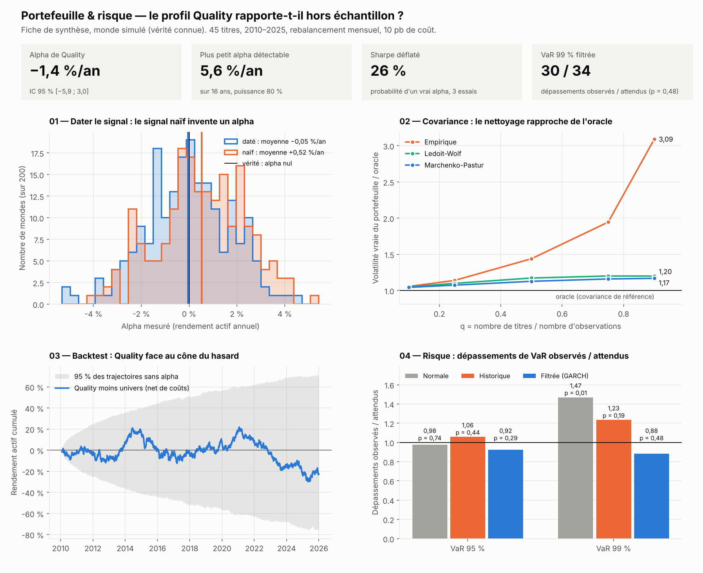

</details>

---

## 01 — Signal daté

Le Projet 1 rattache un ratio à la clôture de l'exercice. Un 10-K n'est déposé que plusieurs semaines plus tard (médiane 48 jours sur les données réelles). Utiliser le ratio dès la clôture, c'est connaître le rapport annuel avant sa publication.

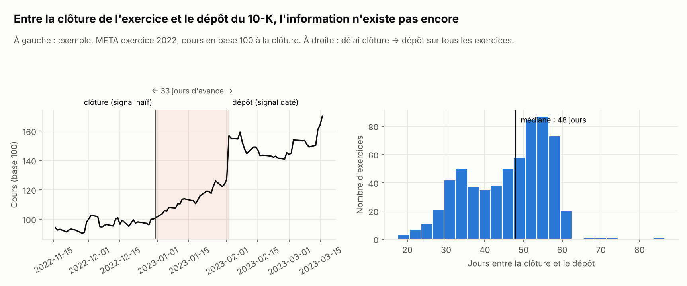

Le signal « daté » n'est disponible qu'au lendemain du dépôt (`signal.asof_panel`, jointure *as-of*). Le test central du projet vérifie que le signal à une date `d` est **identique** qu'on le calcule sur toute la base ou sur une base amputée de tout dépôt postérieur à `d` ; le même test appliqué au signal naïf échoue, ce qui prouve qu'il détecte bien la fuite.

**Validation (vérité connue).** Sur 200 mondes où l'alpha de Quality est nul :

| | Alpha mesuré moyen | Rejet de « alpha = 0 » à 5 % |
|---|---|---|
| Signal daté | −0,05 %/an (± 0,13) | 4,0 % des mondes (attendu : 5 %) |
| Signal naïf | **+0,52 %/an** | 5,5 % |

Le signal daté retrouve zéro et son test est calibré. Le signal naïf fabrique un demi-point d'alpha par an, dans 86 % des mondes. Le biais est trop petit pour se voir dans un seul backtest : c'est ce qui le rend dangereux.

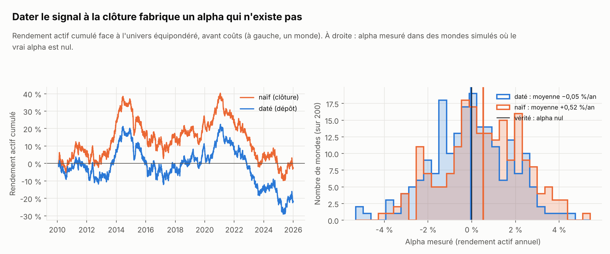

**Données réelles.** Dater à la clôture plutôt qu'au dépôt déplace le rendement actif de +0,38 %/an : même signe et même ordre de grandeur que dans la simulation, mais indiscernable de zéro sur un seul historique (t = 0,43). Le jour du dépôt lui-même, le cours bouge peu (+0,3 % pour les entrants, −0,5 % pour les sortants) : les résultats annuels sont annoncés avant le 10-K. La date de dépôt est donc une borne prudente, jamais en avance.

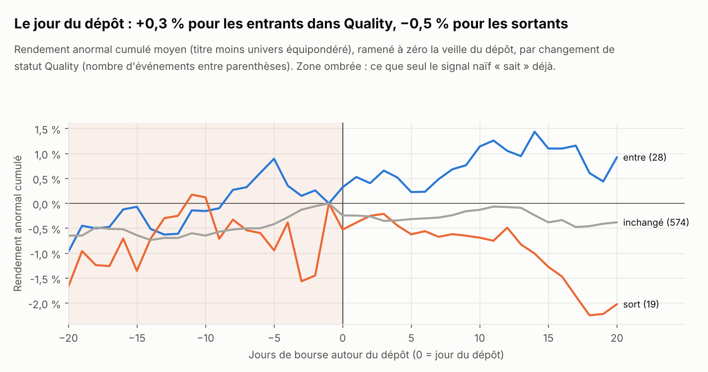

13 % des exercices, surtout 2007–2009, ne sont connus en XBRL que comme comparatifs d'un 10-K ultérieur. Ils ne deviennent disponibles qu'à cette date tardive et ne remplacent jamais un exercice plus récent déjà connu (cas couvert par un test).

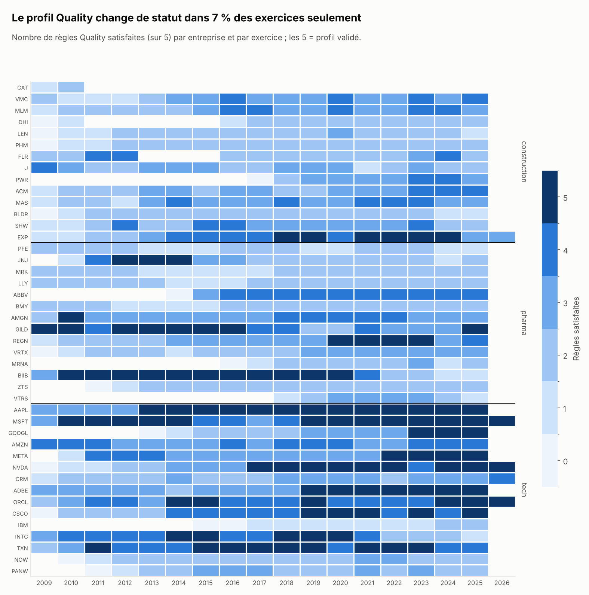

---

## 02 — Covariance

Avec N titres et T observations, la covariance empirique devient inutilisable quand q = N/T n'est plus petit. Trois estimateurs : empirique, Ledoit-Wolf (rétrécissement linéaire), et nettoyage des valeurs propres sous le bord de Marchenko-Pastur (implémenté dans le dépôt, [`covariance.py`](src/quant_portfolio/covariance.py)).

**Validation (vérité connue).** On tire des observations de la vraie covariance du monde simulé et on mesure la volatilité *vraie* du portefeuille à variance minimale, rapportée à celle de l'oracle :

| q = N/T | 0,10 | 0,25 | 0,50 | 0,75 | 0,90 |
|---|---|---|---|---|---|
| Empirique | 1,06 | 1,14 | 1,44 | 1,95 | 3,09 |
| Ledoit-Wolf | 1,05 | 1,10 | 1,17 | 1,20 | 1,20 |
| Marchenko-Pastur | 1,04 | 1,07 | 1,13 | 1,16 | 1,17 |

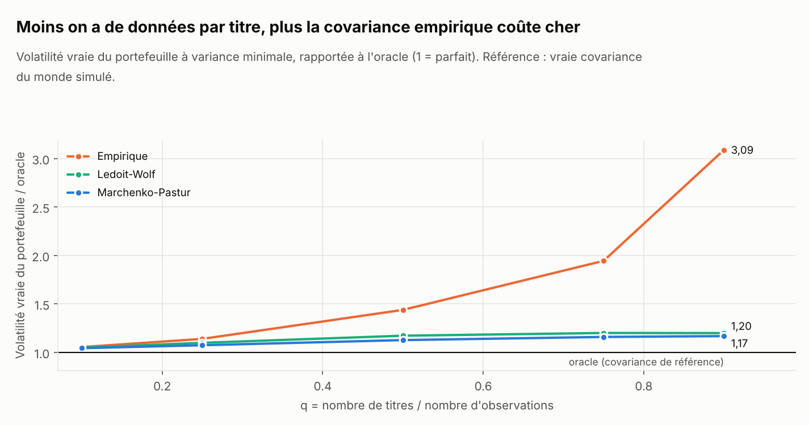

**Données réelles.** Sur 252 jours, 32 des 36 valeurs propres de la matrice de corrélation sont indiscernables du bruit ; les 4 autres sont le marché et les secteurs.

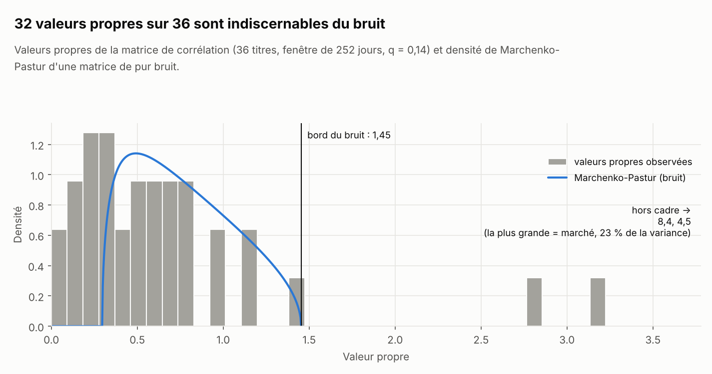

Portefeuille à variance minimale rebalancé chaque mois, volatilité réalisée hors échantillon :

| Fenêtre d'estimation | Empirique | Ledoit-Wolf | Marchenko-Pastur |
|---|---|---|---|
| 63 jours (q = 0,68) | 23,6 % | 15,3 % | 15,3 % |
| 126 jours (q = 0,34) | 16,6 % | 14,8 % | 15,2 % |
| 252 jours (q = 0,17) | 15,0 % | 14,6 % | 15,1 % |

Les deux estimateurs nettoyés évitent l'effondrement de la covariance empirique à fenêtre courte, et divisent le turnover par plus de quatre. Entre eux, le classement de la simulation ne se retrouve pas : sur données réelles Ledoit-Wolf fait aussi bien ou mieux. La simulation a une structure de facteurs propre que le nettoyage spectral retrouve exactement ; le marché réel est moins net.

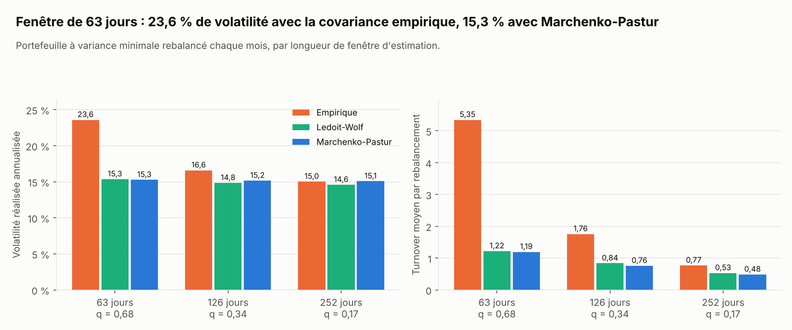

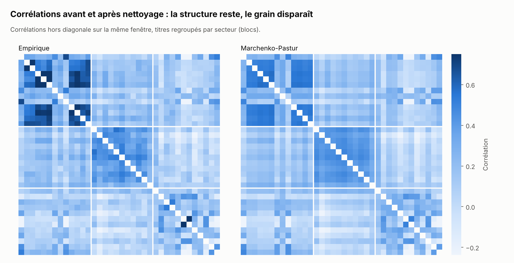

---

## 03 — Backtest

Rebalancement mensuel, poids décidés à la clôture et appliqués à partir du lendemain, 10 pb par unité de turnover. Le rendement jugé est le rendement **actif** : Quality moins l'univers équipondéré.

**Données réelles, 2010–2026 :**

| Portefeuille | Rendement | Volatilité | Sharpe | Drawdown max | Rendement actif | Turnover / an |
|---|---|---|---|---|---|---|
| Quality équipondéré (principal) | 17,8 % | 22,8 % | 0,77 | −34,3 % | −1,6 % | 1,30 |
| Quality inverse volatilité | 19,3 % | 21,2 % | 0,87 | −33,4 % | −0,7 % | 1,31 |
| Quality variance minimale | 13,6 % | 20,0 % | 0,67 | −32,1 % | −5,8 % | 2,56 |
| Univers équipondéré | 20,6 % | 19,1 % | 1,00 | −30,6 % | — | 0,68 |

Ces niveaux de rendement sont gonflés par le biais de survivance (voir [Limitations](#limitations)) : seul l'écart entre lignes a un sens.

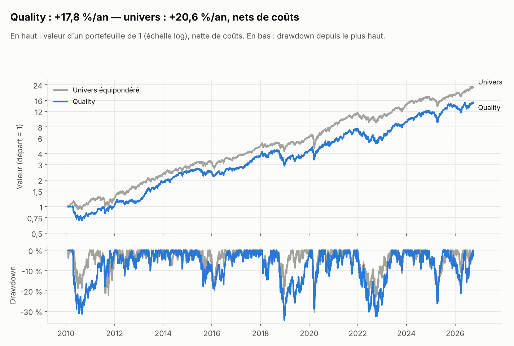

**Se distingue-t-il du hasard ?** Non. Alpha −1,6 %/an, intervalle à 95 % [−7,8 ; +4,1] par bootstrap stationnaire ; Sharpe déflaté 12 %.

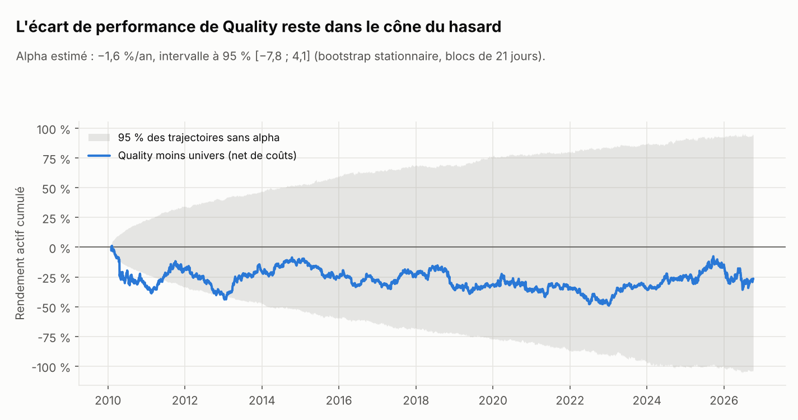

**Ce que l'échantillon permet de voir.** Quality ne retient que 6 titres en médiane (11 au plus), d'où 12,9 % de tracking error. Sur 17 ans, le plus petit alpha détectable 4 fois sur 5 est **7,8 %/an**. « Non significatif » ne veut donc pas dire « nul » : un alpha réel de 3 % passerait inaperçu.

**Laboratoire du hasard.** 1 000 portefeuilles tirés au sort dans le même univers, de même taille que Quality : 39 passent le seuil de 95 % du Probabilistic Sharpe Ratio. Le meilleur affiche un PSR de 99,96 % ; corrigé du nombre d'essais, son Sharpe déflaté tombe à 34 %. Quality se situe au 34ᵉ centile de ces tirages.

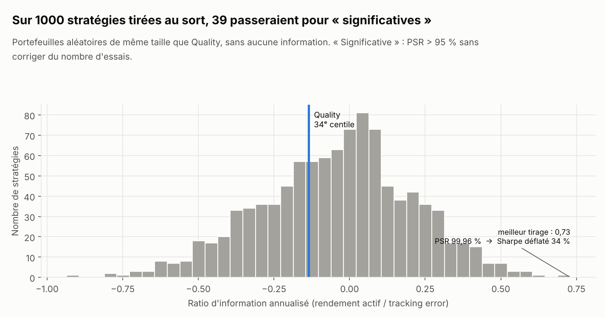

**Ce que Quality achète vraiment.** Régression du rendement actif sur Fama-French 5 facteurs et momentum (erreurs Newey-West) :

| Facteur | Bêta | t |
|---|---|---|
| Marché (MKT) | +0,11 | 3,6 |
| Taille (SMB) | −0,27 | −10,1 |
| Value (HML) | −0,21 | −6,9 |
| Rentabilité (RMW) | +0,16 | 4,9 |
| Investissement (CMA) | −0,22 | −4,4 |
| Momentum (MOM) | +0,01 | 0,6 |

Le profil fait ce que son nom annonce : il charge positivement le facteur de rentabilité, et sélectionne de grandes capitalisations de croissance. Une fois ces expositions retirées, l'alpha résiduel est de −3,9 %/an (t = −1,4), non significatif.

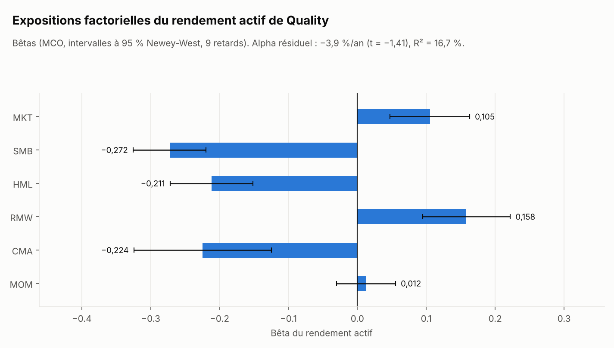

**Validation.** Dans le monde simulé, où l'alpha vrai est nul, l'intervalle [−5,9 ; +3,0] contient bien zéro, et une prime de 6 %/an injectée artificiellement est retrouvée par le backtest (test de puissance).

---

## 04 — Risque

**Validation.** GARCH retrouve des paramètres connus : sur 20 séries simulées (α = 0,08, β = 0,90), α estimé 0,079 ± 0,010, β estimé 0,895 ± 0,015 (quasi-maximum de vraisemblance, [`risk.py`](src/quant_portfolio/risk.py)).

**Données réelles.** Sur le portefeuille Quality : α = 0,136, β = 0,824, persistance 0,960, volatilité de long terme 23,5 %.

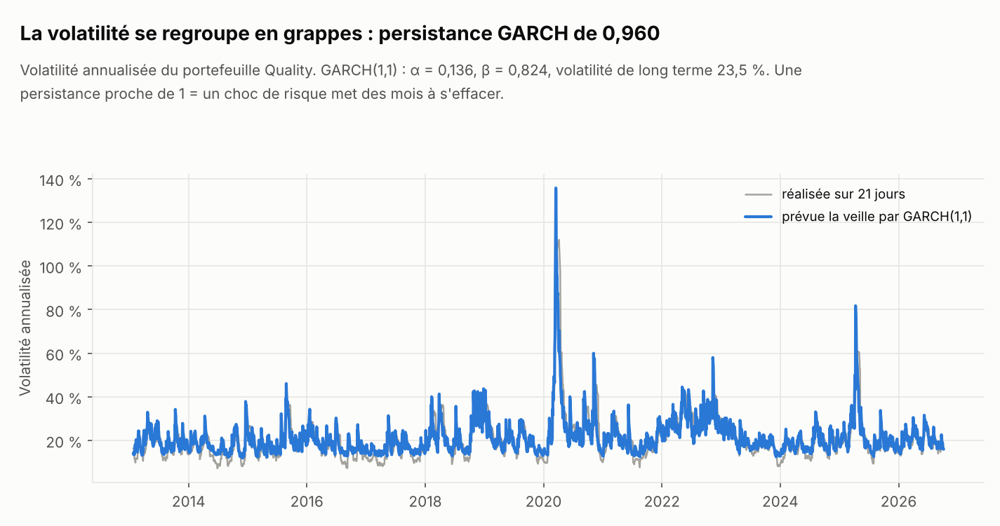

Trois VaR à un jour, jugées hors échantillon sur 3 446 jours. Chaque prévision n'utilise que le passé (vérifié par un test qui réécrit le futur).

| VaR | Seuil | Dépassements (attendus) | Kupiec p | Indépendance p |
|---|---|---|---|---|
| Normale | 95 % | 184 (172) | 0,37 | **0,03** |
| Normale | 99 % | 79 (34) | **0,00** | **0,00** |
| Historique 500 j | 95 % | 187 (172) | 0,26 | 0,13 |
| Historique 500 j | 99 % | 49 (34) | **0,02** | **0,04** |
| Filtrée (GARCH) | 95 % | 193 (172) | 0,11 | 0,79 |
| Filtrée (GARCH) | 99 % | 40 (34) | 0,36 | 0,33 |

Seule la simulation historique filtrée passe les deux tests aux deux seuils, comme dans la simulation. La VaR normale à 99 % est dépassée 2,3 fois trop souvent : les queues réelles sont épaisses (kurtosis 12,6, encore 6,1 après filtrage GARCH).

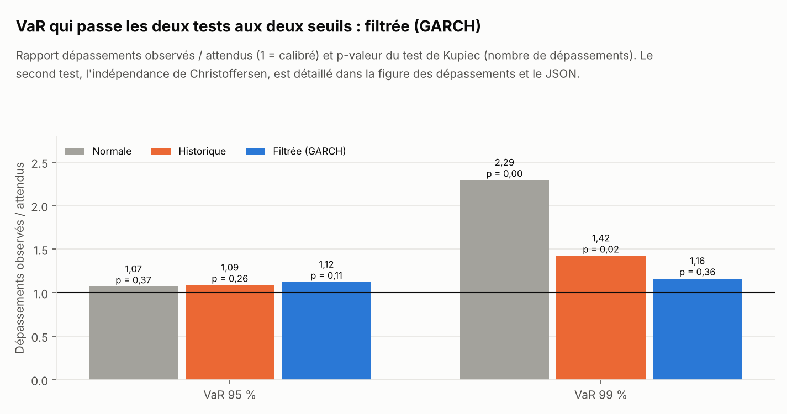

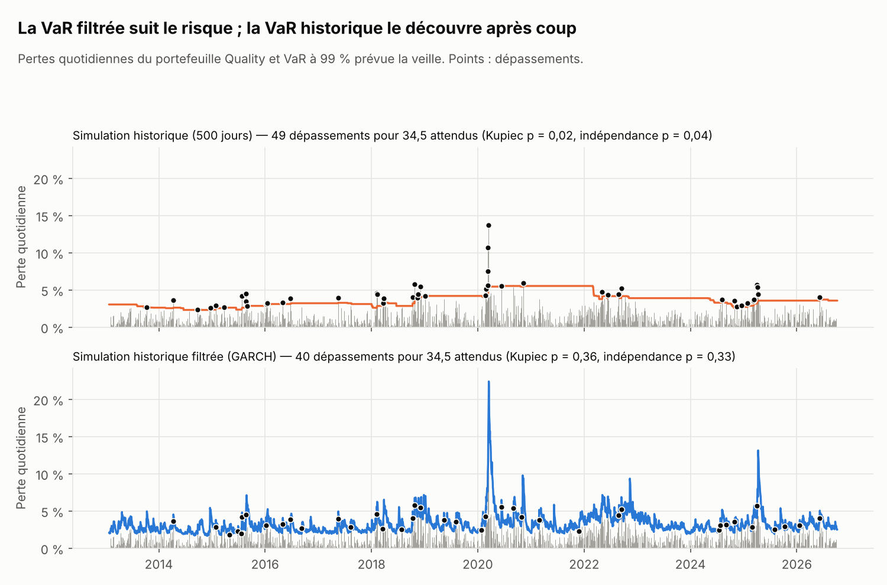

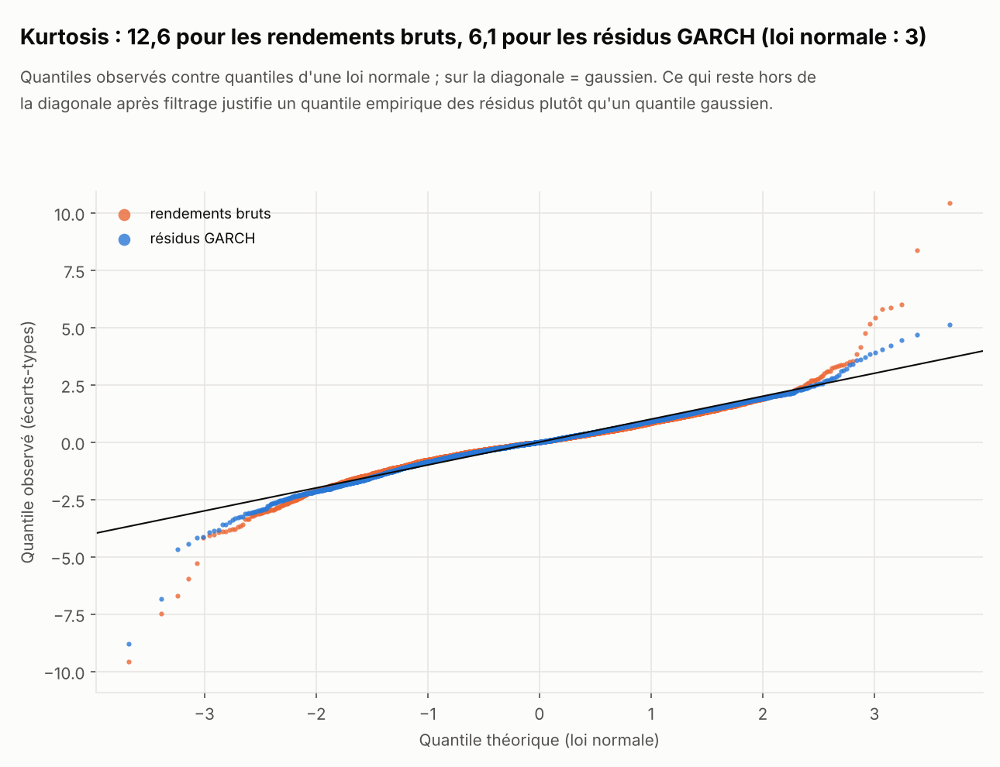

Une réserve : les jours de dépassement, la perte réalisée vaut 0,88 fois l'Expected Shortfall prévu à 99 %. La VaR filtrée est bien calibrée en fréquence, son ES est un peu prudent.

---

## Limitations

- **Biais de survivance.** Les 43 entreprises sont toutes cotées aujourd'hui, et plusieurs sont parmi les plus grands gagnants de la période. L'univers équipondéré affiche 20,6 %/an, ce qui n'est pas un rendement de marché. L'écart Quality − univers est moins touché, mais pas nécessairement épargné.
- **Puissance.** 6 titres en portefeuille en médiane, 17 ans : seuls des alphas de plusieurs points par an seraient détectables.
- **Date de dépôt du 10-K, pas de l'annonce des résultats.** Prudent, jamais en avance, mais tardif de quelques semaines.
- **Un seul signal**, binaire, annuel. Pas de combinaison de signaux, pas de données trimestrielles.
- **Coût forfaitaire**, sans impact de marché ni contrainte de capacité.
- **Variance minimale sans contrainte de signe** : instrument de mesure des estimateurs, pas portefeuille investissable.
- **Covariance de référence.** Sur données réelles, l'expérience « oracle » prend Ledoit-Wolf plein échantillon comme référence, ce qui l'avantage légèrement ; la version sans ambiguïté est celle du monde simulé.

**Extensions possibles**, volontairement laissées de côté pour garder un périmètre resserré : optimisation sous contraintes (long-only, turnover), Black-Litterman avec les scores comme vues, Hierarchical Risk Parity, validation croisée purgée combinatoire, test SPA de Hansen, théorie des valeurs extrêmes, distance au défaut de Merton à partir des bilans du Projet 1.

## Reproducibility

```
git clone https://github.com/samuelhcesari/quant-finance-03-portfolio-risk
cd quant-finance-03-portfolio-risk
python -m venv .venv && source .venv/bin/activate   # ou .venv\Scripts\activate sous Windows
make install
make simulated   # 4 parties, 200 mondes, 18 figures — environ 2 minutes, aucune donnée externe
make test        # 28 tests
```

Données réelles — le Projet 1 doit être cloné dans le dossier voisin et son pipeline déjà exécuté (`data/processed/financials_annual.csv`) :

```
make fetch       # prix ajustés (Yahoo) + facteurs Fama-French
make real        # results/benchmark_real.json et results/figures/real/
```

Le monde simulé est à graine fixée : deux exécutions donnent un `benchmark_simulated.json` identique à l'octet. Les résultats réels dépendent de la date de téléchargement (ici : prix jusqu'au 6 octobre 2026, facteurs jusqu'au 31 août 2026).

## Usage

```python
from quant_portfolio import config, signal, covariance, backtest, risk
from quant_portfolio.simulate import simulate

cfg = config.load()
world = simulate(cfg)                                              # ou world.load_real(cfg)

m = signal.quality(signal.metrics(world.fund), cfg["quality_rules"])
dates = backtest.month_ends(world.returns.index, "2010-01-01")
flag = signal.asof_panel(m, dates, "avail_pit")                    # signal daté au dépôt

r, turnover = backtest.run(backtest.equal_weight(flag == 1), world.returns, cost_bps=10)
backtest.psr(r.values)                                             # Probabilistic Sharpe Ratio

covariance.mp_clip(world.returns.iloc[-252:].values)               # covariance nettoyée
risk.garch_fit(r.values)["alpha"]                                  # GARCH(1,1)
```

## Tests

```
pytest
```

28 tests, ciblés sur ce qui peut fausser un résultat sans faire planter le code : fuite de données futures dans le signal, dans le moteur de backtest et dans la VaR ; ratios recalculés à la main ; formules (PSR, maximum attendu de N Sharpe, densité de Marchenko-Pastur, variance minimale à deux actifs) ; récupération de paramètres connus (GARCH, bêtas, prime de 6 %/an injectée dans la simulation).

## References

- Bailey, D. & López de Prado, M. (2014) — *The Deflated Sharpe Ratio*.
- Fama, E. & French, K. (2015) — *A five-factor asset pricing model*.
- Ledoit, O. & Wolf, M. (2004) — *A well-conditioned estimator for large-dimensional covariance matrices*.
- Laloux, Cizeau, Bouchaud & Potters (1999) — *Noise dressing of financial correlation matrices*.
- Politis, D. & Romano, J. (1994) — *The stationary bootstrap*.
- Newey, W. & West, K. (1987) — covariance HAC.
- Barone-Adesi, Giannopoulos & Vosper (1999) — simulation historique filtrée.
- Kupiec (1995) ; Christoffersen (1998) — tests de couverture de la VaR.
- Harvey, Liu & Zhu (2016) — *…and the Cross-Section of Expected Returns* (tests multiples).
